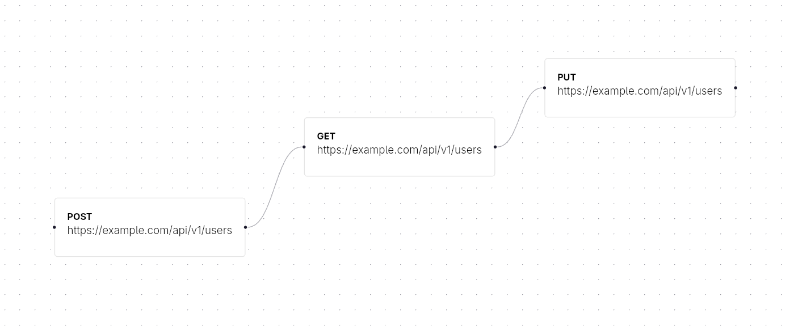

# ⚡ Circuito



> The ultimate node-based API testing client. Built for performance, designed for complex flows.


**Circuito** is a next-generation API Client that combines the simplicity of text-based configuration with the power of visual node-based workflows. Built with **Rust** and **Tauri**, it is designed to be lightweight, incredibly fast, and fully "GitOps friendly".

Unlike traditional tools (Postman, Insomnia) that force you into linear lists or bloated Electron apps, Circuito treats your API tests as **logical flows**, allowing you to chain requests, manipulate data, and visualize architecture in real-time.

---

## 🚀 Why Circuito?

- **⚡ Blazing Fast:** Built on Tauri (Rust backend), consuming a fraction of the RAM compared to Electron alternatives.
- **🔗 Node-Based Workflow:** Visualize your API logic. Connect a _Login_ node to a _Get User_ node just by dragging a cable.
- **📄 Git Friendly:** All flows and collections are saved as human-readable text files (TOML/YAML). Version control your tests alongside your code.
- **🔌 Multi-Protocol:** First-class support for **REST**, **gRPC**, and **Kafka** (Event-Driven testing).
- **🛠️ Local First:** No mandatory cloud login. Your data belongs to you.

---

## 🛠️ Tech Stack

**Core:**

- [Tauri v2](https://tauri.app/) (Rust) - App Shell & Backend execution
- [Tokio](https://tokio.rs/) - Async runtime
- [Reqwest](https://docs.rs/reqwest/) - HTTP Client

**Frontend:**

- [React](https://react.dev/) + [Vite](https://vitejs.dev/)
- [TypeScript](https://www.typescriptlang.org/)
- [React Flow](https://reactflow.dev/) - Node engine
- [Zustand](https://github.com/pmndrs/zustand) - State management
- [ShadCN UI](https://ui.shadcn.com/) + [TailwindCSS](https://tailwindcss.com/) - Styling

---

## 🚧 Roadmap

We are currently in the **Pre-Alpha** stage.

- [x] **Project Setup**: Tauri v2 + React + ShadCN initialized.
- [ ] **HTTP Engine**: Basic GET/POST/PUT/DELETE requests via Rust.
- [ ] **Visual Interface**: Drag & Drop nodes to build request flows.
- [ ] **File System**: Save/Load flows from local `.json` files.
- [ ] **gRPC Support**: Dynamic `.proto` file loading and execution.
- [ ] **Event-Driven**: Kafka Producer/Consumer nodes.

---

## 💻 Getting Started

### Prerequisites

- [Node.js](https://nodejs.org/) (v18+)
- [Rust](https://www.rust-lang.org/tools/install) (latest stable)
- System dependencies for Tauri (check [Tauri Docs](https://tauri.app/v1/guides/getting-started/prerequisites))

### Installation

1. **Clone the repository**

   ```bash
   git clone [https://github.com/Niwau/circuito.git](https://github.com/your-username/circuito.git)
   cd circuito
   ```

````

2. **Install frontend dependencies**

    ```bash
    npm install
    # or
    pnpm install
    ```

3. **Run in Development Mode**
    This will start the Vite server and the Tauri window.

    ```bash
    npm run tauri dev
    ```

---

## 🤝 Contributing

Contributions are what make the open-source community such an amazing place to learn, inspire, and create. Any contributions you make are **greatly appreciated**.

1. Fork the Project
2. Create your Feature Branch (`git checkout -b feature/AmazingFeature`)
3. Commit your Changes (`git commit -m 'Add some AmazingFeature'`)
4. Push to the Branch (`git push origin feature/AmazingFeature`)
5. Open a Pull Request

---

## 📝 License

Distributed under the MIT License. See `LICENSE` for more information.
````
